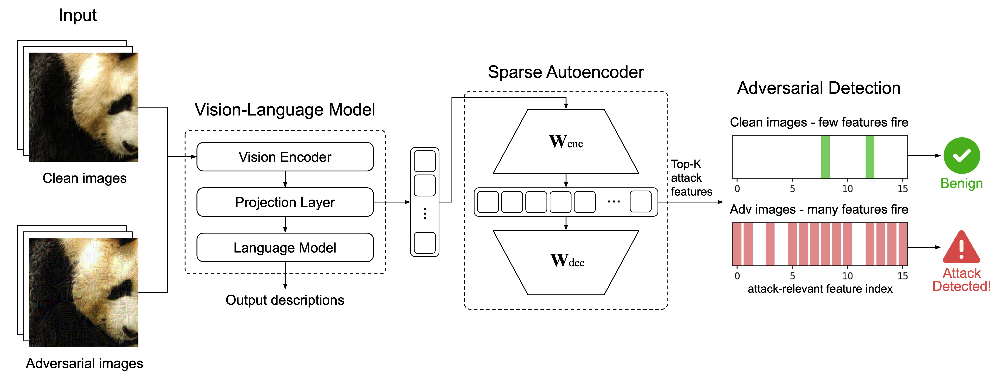

<div align="center" style="font-family: charter;">


# SAEgis: Sparse Autoencoders as Plug-and-Play Firewalls for Adversarial Attack Detection in VLMs



[Hao Wang](https://www.conan1024hao.com/)<sup>1,2</sup>\*, Yiqun Sun<sup>1</sup>, Pengfei Wei<sup>1</sup>, Lawrence B. Hsieh<sup>1</sup>, Daisuke Kawahara<sup>2</sup>

<sup>1</sup>Magellan Technology Research Institute (MTRI) &nbsp;&nbsp; <sup>2</sup>Waseda University

**Paper:** https://arxiv.org/abs/2605.07447v1

**SAE checkpoints:** [`mtri-admin/qwen25-vl-3b-sae` (Hugging Face collection)](https://huggingface.co/collections/mtri-admin/qwen25-vl-3b-sae)

<p align="justify"><i>Vision-language models (VLMs) have advanced rapidly and are increasingly deployed in real-world applications, especially with the rise of agent-based systems. However, their safety has received relatively limited attention. Even the latest proprietary and open-weight VLMs remain highly vulnerable to adversarial attacks, leaving downstream applications exposed to significant risks. In this work, we propose a novel and lightweight adversarial attack detection framework based on sparse autoencoders (SAEs), termed SAEgis. By inserting an SAE module into a pretrained VLM and training it with standard reconstruction objectives, we find that the learned sparse latent features naturally capture attack-relevant signals. These features enable reliable classification of whether an input image has been adversarially perturbed, even for previously unseen samples. Extensive experiments show that SAEgis achieves strong performance across in-domain, cross-domain, and cross-attack settings, with particularly large improvements in cross-domain generalization compared to existing baselines. In addition, combining signals from multiple layers further improves robustness and stability. To the best of our knowledge, this is the first work to explore SAE as a plug-and-play mechanism for adversarial attack detection in VLMs. Our method requires no additional adversarial training, introduces minimal overhead, and provides a practical approach for improving the safety of real-world VLM systems.</i></p>

</div>

## Release
- `2026-05-09` :rocket: We released the pipeline implementation of SAEgis along with SAE weights for Qwen2.5-VL-3B.


## Repo layout

The pipeline caches per-image SAE activations on clean and adversarially perturbed images, ranks features that shift most under attack, and evaluates a simple detector that scores samples by how many attack-sensitive SAE features fire (ROC/AUC, precision–recall, F1 at fixed false-positive rates).

| File | Role |
|------|------|
| [`cache_activations.py`](cache_activations.py) | Loads Qwen2.5-VL + SAE LoRA, runs a forward pass per image, writes cached SAE activations to disk. |
| [`analyze_features.py`](analyze_features.py) | Compares attacked vs. clean activation statistics and writes `top_features.json` (ranked feature indices and score deltas). |
| [`defense_attack.py`](defense_attack.py) | Uses those top features as a detector: plots distributions and reports AUC / PR / threshold metrics. |
| [`defense_attack_ensemble.py`](defense_attack_ensemble.py) | Ensemble variant combining multiple SAE locations. |
| [`baseline/`](baseline/) | Dense cosine-similarity baselines for comparison. |
| [`utils/`](utils/) | Feature-overlap and top-feature visualization helpers. |

Each Python entrypoint has a matching `*.sh` orchestration script.


## Installation

1. **Python environment**

   ```bash
   python3 -m venv .venv
   source .venv/bin/activate
   ```

2. **SAE library** (editable install; provides `PeftSaeModel` and TopK SAE layers)

   ```bash
   git clone -b work-branch --single-branch https://github.com/conan1024hao/sae.git
   cd sae && pip install -e . && cd ..
   ```

3. **Other dependencies**

   ```bash
   pip install torch transformers accelerate tqdm python-dotenv matplotlib numpy scikit-learn qwen-vl-utils
   ```

4. **Hugging Face token** (SAE checkpoints under `mtri-admin/qwen2.5-vl-3b-sae-*` may be gated)

   ```bash
   export HUGGINGFACE_TOKEN=hf_...
   ```

   Or place `HUGGINGFACE_TOKEN=...` in a `.env` file (loaded via `python-dotenv`).


## Pipeline

### 1. Cache SAE activations

```bash
bash cache_activations.sh
```

Runs [`cache_activations.py`](cache_activations.py) over the configured datasets, splits, and attack methods. Writes one `.pt` file per image.

**Defaults (edit in the script):**

- Base model: `Qwen/Qwen2.5-VL-3B-Instruct`
- SAE location: e.g. `projection-mlp2` → Hub id `mtri-admin/qwen2.5-vl-3b-sae-<location>-finevisionmax-500k`
- Datasets: `NIPS17`, `LLaVA-Instruct-150K`, `Medical-Multimodal-Eval`
- Splits: `train`, `dev`, `test`
- Attacks: `SSA-CWA`, `M-Attack`, `FOA-Attack`

**Image layout:**

```text
images/<DATASET>/original/<split>/
images/<DATASET>/attacked/<ATTACK_METHOD>/<split>/
```

**Output layout:**

```text
sae_activations/<DATASET>/<SAE_LOCATION>/original-<split>/
sae_activations/<DATASET>/<ATTACK_METHOD>/<SAE_LOCATION>/attacked-<split>/
```

### 2. Rank attack-relevant features

```bash
bash analyze_features.sh
```

Scores SAE features on attacked **dev** vs. original **train** activations and saves the top-1000 indices with signed score deltas to:

```text
top_feature_idxs/<DATASET>/<ATTACK_METHOD>/<SAE_LOCATION>/top_features.json
```

### 3. Evaluate detection

```bash
bash defense_attack.sh
```

Loads clean **dev** / **test** and attacked **test** caches, picks the top-`NUM_FEATURES` indices from `top_features.json`, and scores each sample by the mean number of activated features in that set. Writes histogram, PR, and ROC plots under `figs/` and prints AUC, max-F1, and precision/recall at percentile-based thresholds.

For the ensemble variant across multiple SAE locations:

```bash
bash defense_attack_ensemble.sh
```

### Baseline

Dense embedding cosine-similarity baselines:

```bash
bash baseline/dense_cos_similarity.sh
bash baseline/dense_cos_similarity_ensemble.sh
```

## Acknowledgement
The pipeline code is build upon [EvolvingLMMs-Lab/sae](https://github.com/EvolvingLMMs-Lab/sae). We acknowledge their team for providing this excellent toolkit for training multimodal SAEs.

## Citation
```
@misc{wang2026sparseautoencodersplugandplayfirewalls,
      title={Sparse Autoencoders as Plug-and-Play Firewalls for Adversarial Attack Detection in VLMs}, 
      author={Hao Wang and Yiqun Sun and Pengfei Wei and Lawrence B. Hsieh and Daisuke Kawahara},
      year={2026},
      eprint={2605.07447},
      archivePrefix={arXiv},
      primaryClass={cs.CV},
      url={https://arxiv.org/abs/2605.07447}, 
}
```
